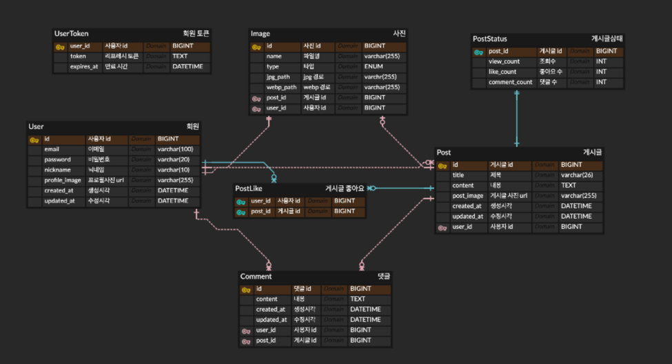

# community

취향과 일상을 나누는 커뮤니티 서비스의 백엔드 레포지토리입니다.
Spring Boot + MySQL로 서버를 구현했고, 회원가입/로그인부터 게시글·댓글·좋아요·이미지 업로드까지 커뮤니티에 필요한 기능을 도메인 단위로 구현했습니다.

## 개발 인원 및 기간

- 개발기간: 2026-0X ~ 진행중
- 개발 인원: 백엔드 1명 (본인)
- Front-end: [4-ayla-community-FE](../4-ayla-community-FE)

## 사용 기술 및 tools

- Java 21, Spring Boot 4
- Spring Data JPA, QueryDSL (커서 기반 페이지네이션)
- MySQL
- JWT (jjwt) 기반 인증 + Refresh Token
- bcrypt (비밀번호 암호화)
- Scrimage (이미지 jpg/webp 변환)
- Spring Actuator + Micrometer/Prometheus (모니터링)

## 폴더 구조

```
domain
 ├─ user            # 회원가입, 내 정보, 회원탈퇴
 ├─ auth            # 로그인, JWT 발급/재발급
 ├─ post
 │   ├─ comment      # 댓글 CRUD
 │   ├─ postLike     # 좋아요
 │   └─ postStatus   # 조회수/좋아요수/댓글수 집계
 └─ image           # 프로필/게시글 이미지 업로드
global
 ├─ jwt / filter / security   # 인증 필터, 로그인 유저 리졸버
 ├─ page                      # 커서 기반 페이지네이션 공통 로직
 ├─ exception / response      # 공통 예외 처리, 응답 포맷
 └─ config
```

각 도메인은 `api(controller/dto) - application(service) - repository - entity` 구조로 구성했습니다.

## 구현 기능

**User**
- 회원가입 / 내 정보 조회·수정 / 비밀번호 변경 / 회원탈퇴
- bcrypt로 비밀번호 암호화
- 이메일/닉네임 중복 검사

**Auth**
- JWT Access/Refresh 토큰 발급, 만료 시 재발급(`/auth/refresh`)
- Access Token은 헤더(`Authorization: Bearer`)로, Refresh Token은 httpOnly 쿠키로 관리
- 로그인 필터 + `@LoginUser` 리졸버로 인증된 유저만 API 접근 허용

**Post / Comment**
- 게시글·댓글 CRUD
- 커서 기반 무한스크롤 페이지네이션 (최신순/오래된순/좋아요순)
- 좋아요, 조회수/좋아요수/댓글수는 `PostStatus`로 별도 집계

**Image**
- 프로필/게시글 이미지 업로드 시 jpg + webp로 변환해 저장
- DB에는 이미지 경로만 저장, 이미지는 선택사항(미첨부 가능)

## 데이터베이스 설계

**요구사항**
- 유저: 이메일/닉네임은 유니크, 프로필 이미지는 선택
- 게시글: 작성자를 참조, 좋아요/조회수/댓글수는 별도 테이블로 집계해 쓰기 경합 최소화
- 댓글: 게시글을 참조, 작성자 정보를 함께 응답
- 인증: Refresh Token을 DB에 저장해 재발급/로그아웃 시 무효화 가능하도록 관리

**E-R Diagram**


## 트러블 슈팅

- **댓글 목록 응답 구조 불일치**: FE는 댓글 작성자를 `author: { userId, nickname, profileImageUrl }` 중첩 객체로 기대하는데, BE는 `author`(닉네임 문자열)/`profileImage`를 평탄한 필드로 내려주고 있었음. `CommentAuthorResponse`를 새로 만들어 응답 구조를 FE 기대값에 맞춤.
- **게시글 목록 중복 표시 & 페이지네이션 오작동**: FE 무한스크롤에서 초기 로딩 직후 `isEnd`/`isProcessing` 상태를 다시 초기화하는 코드가 있어, 마지막 페이지에 도달했음에도 스크롤 시 첫 페이지를 다시 요청해 게시글이 중복 렌더링되던 문제. 불필요한 상태 초기화 코드를 제거해 해결.
- **이미지 미첨부 시 연쇄 오류**: 이미지가 선택사항이라는 설계 의도와 달리, 실제 로직 곳곳(회원가입, 게시글/회원 삭제)에서 이미지가 항상 있다고 가정해 `imageId`/`imageUrl`이 `null`이면 500/404가 발생하던 문제들을 각 서비스에 null 가드를 추가해 해결.
- **회원탈퇴 시 게시글 잔여 데이터**: 회원탈퇴 로직이 게시글만 지우고 그에 딸린 좋아요/상태/이미지, 그리고 타인이 남긴 댓글·좋아요는 정리하지 않아 데이터 정합성이 깨지던 문제. 게시글 삭제 로직을 재사용하는 `deleteAllPostsByUser`로 교체해 해결.
